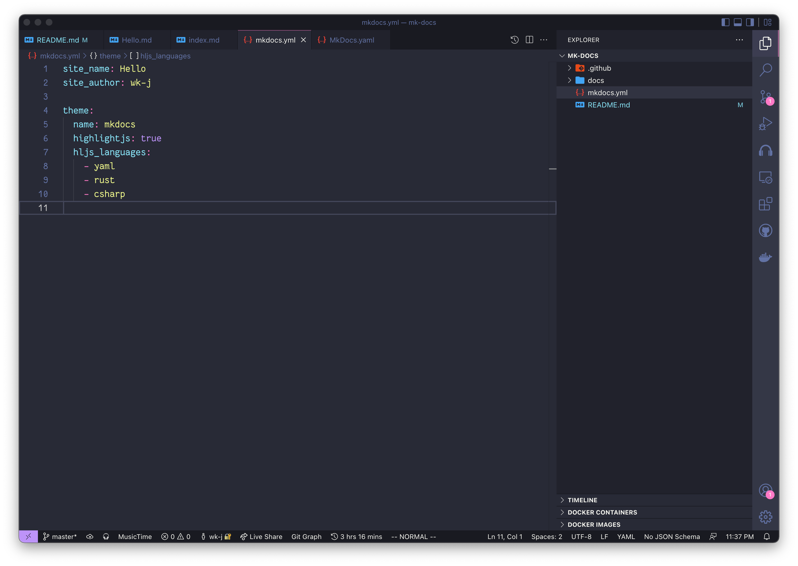

## Installation



```csharp
using X.Y.Z;

public class Hello() {
    public void Install() {
        App.Install();
    }
}
```

## Setup

```python
import x.y.z

print("Hello, world!")
```

## Uninstallation

```java
import x.y.z;

public class Hello() {
    public void uninstall() {
        App.uinstall();
    }
}
```